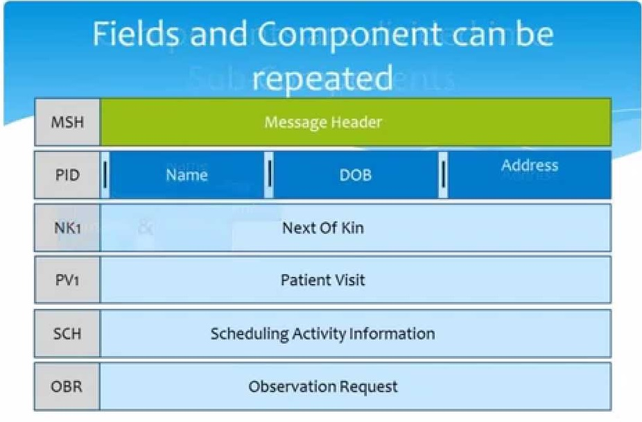
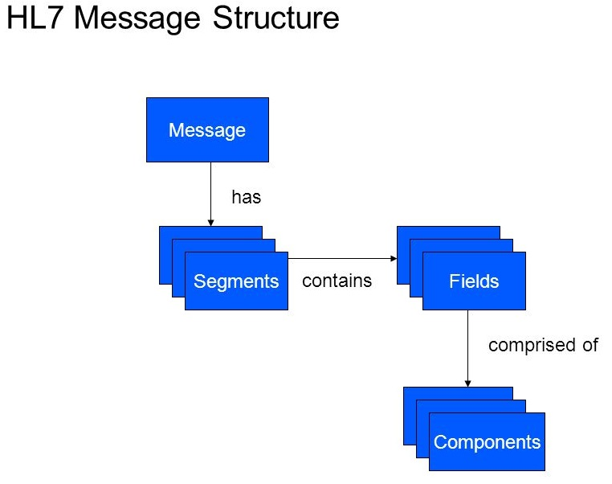

# hl7tutorials
HL7 is a messaging standard that helps clinical applications exchange electronic health information.
This is a standard for the exchange / integration / sharing / retrieval of electronic health information and increase the effectiveness, efficiency and quality of their healthcare information delivery,

This can be communicated using a variety of transport protocols such as.
*   LLP - Lower Layer Protocol / MLLP - Minimal Lower Layer Protocol 
*   FTP - File Transfer Protocol
*   SMTP - Simple Mail Transfer Protocol

This made integration and maintenance of applications, particularly from different vendors, very easy.
 
 Eg: 
 *  Patient Registration System
 *  Laboratory System
 *  Billing System
 
 ## HL7 Message Content and Description 
 
* Message [Message Types]
  * Segments (Some are repeatable, mandatory and optional)
     * Elements / Fields (Some are Repeatable)
       * Components
         * Subcomponents

  
  
  
   
 * 0x0B - Header             
 * 0x0D – Marks the end of each segment.
 * 0x1C 0x0d - Trailer
 * | – element /field delimiter.
 * ^ – component delimiter.
 * & – Sub-component delimiter.
 * ~ – Used to separate repeating fields.
 * \ – Escape character.
 
# Glossary
 
*   HL7 : Health Level Seven, Inc
*   HAPI : HL7 application programming interface
*   FHIR : Fast Healthcare Interoperability Resources 

# References

*   [HL7 - Overview](https://saravanansubramanian.com/hl7tutorials)
*   [Introduction to HL7 Standards](https://www.hl7.org/implement/standards/)
*   [hapi-examples](https://github.com/hapifhir/hapi-hl7v2/tree/master/hapi-examples)
*   [https://github.com/SaravananSubramanian/hl7](https://github.com/SaravananSubramanian/hl7)
*   [HAPI Dependencies](https://hapifhir.github.io/hapi-hl7v2/getting_started.html)  
*   [Informatics - Radiology Workflow](https://www.youtube.com/watch?v=czApoO5N9K8) 
*   [Introducing HL7 FHIR](https://www.hl7.org/fhir/summary.html)
*   [HL7 Tutorial Directory](https://www.hl7soup.com/HL7Tutorials.html)